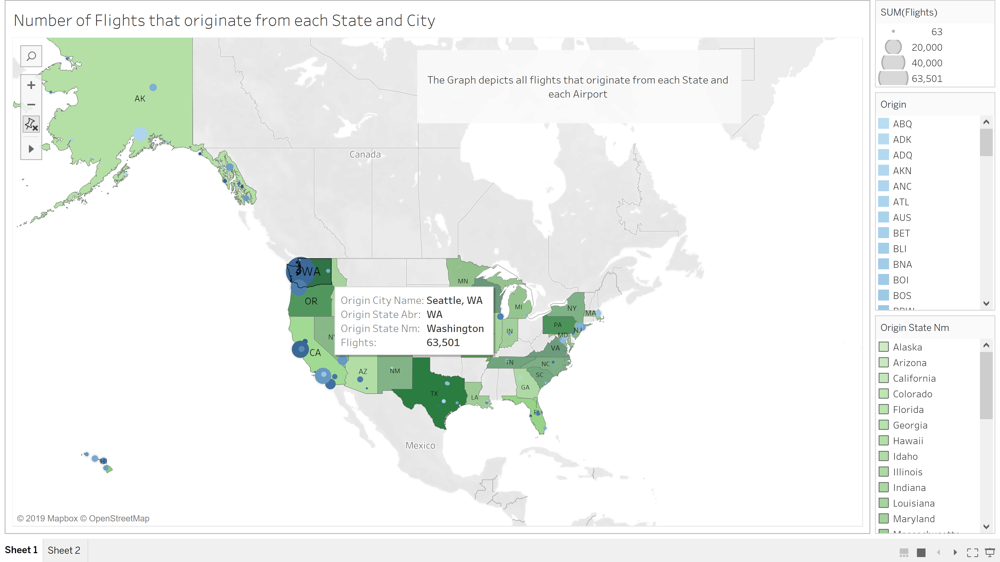
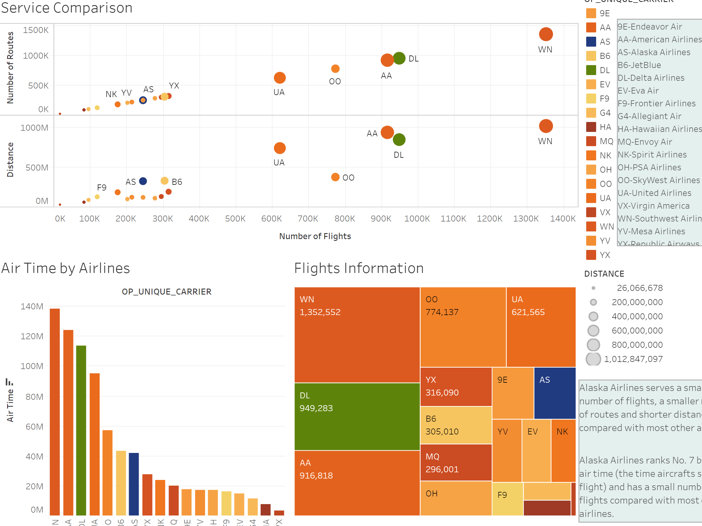

## Visualise and Analyse frequency of delay/cancelled flight the Alaskan Airline (AS) for the year 2018.

Kindly check the below link for the entire project:
## https://public.tableau.com/profile/dhruv.dhami#!/vizhome/PerformanceAnalysis-AlaskaAirlines/AlaskaAirlinesAnalysis

Contents:

1. Introduction: 
    -Route Information 
    -Service Location: : Headquartered at Seattle
    -Number of Flight by Quarter, Month, Day
    
2. On-time Performance:
    -Delay performance by Time
    -Cancellation performance by Time
    
3. Comparison with the Industry
    -Service time comparison
    -Delay comparison        :Performs better compared to other airlines
    -Cancellation comparison :Performs better compared to other airlines maybe be beauce of overall less flights.
    
4. Compititor: 
    -Indentify compititor based on route ## Delta Airlines (DL)
    -Delay comparison         : Average Arrival delay for both airlines is the same, but AS outperforms Delta by a margin when it comes to average departure delay.
    -Cancellation comparison  : DL has lesser cancelled flights than AS
    
## Final Conclusion
  1) Based on the On-time performance analysis, AS should take actions and control NAS delays as it was reponsible for 42% of the delays. Although compared to industry standards        of 19% delay in flights, AS had 13% delayed flights.
  2) Departure delays from ADK(Adak Airport) and EWR(Newark Liberty International Airport) airports could be reduced as they had the highest average delay minutes. However, due to      the extreme weather conditions in Alaska, there might not be a great scope of improvement.
  3) The month of August had maximum delays and overall 4th quarter had more delayed/cancelled flights, most probably due to harsh winters.
    
Dataset : Bureau of Transportation Statistics (https://www.bts.gov/topics/airlines-and-airports-0)

Sample Sheets:

